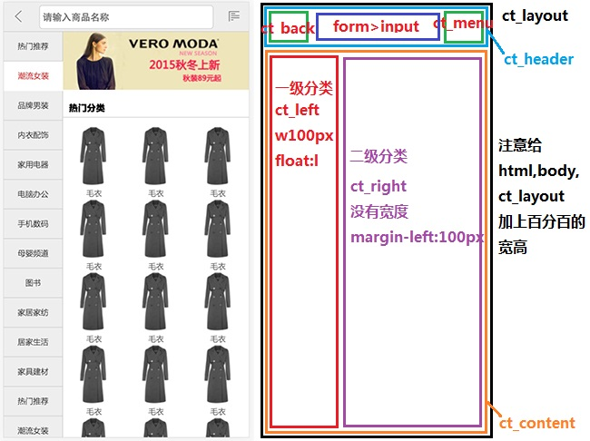

> # 移动web开发

---

​	主要理解如何实现滑动，默认点击延迟的解决


## 1.0 分类页面的构建

​	

###  全屏页面

​		水平和垂直都没有滚动条，高度和宽度都是自适应，多余的内容会在当前的区域滚动



###1.1 主体结构如下

```html
    <div class="ct_layout">
        <div class="ct_header">
            <a href="javascript:;" class="ct_back"></a>
            <form action="" class="ct_search">
                <input type="text" placeholder="请输入商品">
            </form>
            <a href="javascript:;" class="ct_menu"></a>
        </div>
        <div class="ct_content">
            <div class="ct_left"></div>
            <div class="ct_right"></div>
        </div>
    </div>
```


###1.2 页面主体样式

```css
html, body {
    width: 100%;
    height: 100%;
}

.ct_layout {
    width: 100%;
    height: 100%;
    /* set maxwidth & center */
    max-width: 640px;
    margin: 0 auto;
}

/* ct_header site start */
.ct_header {
    position: absolute;
    max-width: 640px;
    width: 100%;
    height: 50px;
    background-color: #eee;
    border: 1px solid #ccc;
}

/* ct_content site start */
.ct_content {
    height: 100%;
    background-color: #ccc;
    padding-top: 50px;
}

.ct_left {
    float: left;
    width: 100px;
    height: 100%;
    background-color: hotpink;
}

.ct_right {
    margin-left: 100px;
    height: 100%;
    background-color: skyblue;
}
```


### 1.3 完成顶部搜索栏

	>使用CSS3中的两个背景属性
	>
	>background-origin: content-box;      /设置显示的参考 , 默认是border-box /
	>
	>background-clip: content-box;    /*设置显示的裁切，默认是border-box*/

​	也就是说，以前是使用两个盒子设置，现在使用一个盒子显示精灵图的部分，还要扩大空白的显示

```css
.ct_back,
.ct_menu {
    position: absolute;
    top: 0;
    width: 49px;
    height: 49px;
    padding: 14px;
    background: url("../images/jd-sprites.png") no-repeat;
    background-size: 200px auto;
    /* 使用精灵图，要扩大点击区域，以前使用两个盒子，这次不用 */
    background-origin: content-box;
    background-clip: content-box;
}

.ct_back {
    left: 0;
    background-position: -20px 0;
}

.ct_menu {
    right: 0;
    background-position: -60px 0;
}

.ct_search {
    width: 100%;
    height: 100%;
    padding: 0 60px;
}

.ct_search input {
    width: 100%;
    height: 40px;
    margin-top: 5px;
    border-radius: 5px;
    font-size: 16px;
    color: #666;
    padding-left: 10px;
}
```


### 1.4 完成左侧布局


```css
.ct_cLeft > ul {
    width: 100%;
    position: absolute;
    top: 0;
    left: 0;
}

.ct_cLeft li{
    height: 50px;
    width: 100%;
}

.ct_cLeft li a{
    width: 100%;
    height: 100%;
    display: block;
    background-color: #eee;
    color: #333;
    line-height: 50px;
    text-align: center;
    border-bottom: 1px solid #ccc;
    border-right:1px solid #ccc;
}

.ct_cLeft li.active a{
    background-color: #fff;
    border-right: none;
    border-bottom: none;
    color: #e92322;
}
```


### 1.5 完成右侧布局

​	使用伸缩盒子完成产品列表的自动撑满

​	步骤1： 给父盒子加上 display: flex; flex-derection: cloum;

​	步骤2：给子盒子(hotCategory)加上 flex: 1;

```css
.ct_rImg{
    width: 100%;
    display: block;
}
.ct_rImg > img{
    width: 100%;
    display: block;
}
.ct_cRight > h3{
    height: 30px;
    line-height: 30px;
    padding-left:10px;
    border-bottom: 1px solid #ccc;
}
.ct_hotCategory{
    width: 100%;
    overflow: hidden;
    flex: 1;
}
.ct_hotCategory  li{
    width: 33.33%;
    float: left;
    text-align: center;
}
```


---


## 2.0 一级分类的滑动

​	实现基本的滑动，注意要累计每一次滑动后的偏移量

​	注意1： 声明变量要初始为0，在使用的时候要在差值后加入，在每一次结束的是 += 累加

​	注意2： 滑动开始记录初始值，滑动过程计算差值，然后让盒子发生位移，滑动结束任务不多

```javascript
window.onload = function() {
    // 1.0 完成一级分类导航的滑动
    // 找到目标元素
    var conLeft = document.querySelector(".ct_left");
    var ulBox = conLeft.children[0];
    // 1.1 给ul盒子注册滑动事件
    // 声明记录值的几个变量
    var startY, moveY, distanceY, currentY = 0;
    // 1.1.1 设置开始触摸（执行1次）
    ulBox.addEventListener("touchstart", function(e) {
        // 记录初始位置
        startY = e.targetTouches[0].clientY;
    })
    // 1.1.2 设置触摸滑动
    ulBox.addEventListener("touchmove", function(e) {
        // 获取时时的坐标信息
        moveY = e.targetTouches[0].clientY;
        // 获取差值 + 上一次移动的偏移量
        distanceY = moveY - startY + currentY;
        // 实现ul盒子的无过渡位移
        ulBox.style.transition = "none";
        ulBox.style.transform = "translateY("+ distanceY +"px)";
    })
    // 1.1.3 设置触摸结束，累计移动过后的偏移量
    ulBox.addEventListener("touchend", function() {
        currentY = distanceY;
    })
}
```


### 2.1 设置滑动区间

​	静止展示状态（固定）

​		顶部 => 最大值 (静止偏移最小)，0，紧紧顶着上面

​		底部 => 父盒子的高度 - 内容盒子的高度 = 最小值 (往上负偏移量最多)， 紧紧贴合底部，负值


​	滑动缓冲状态（临时）

​		顶部 => 0 + 100， 正值，再往下拉就不动

​		底部 => 最小值 - 100， 负值， 再往上拉就拉不动


```javascript
// 2.0 声明静止状态和滑动状态的值
var max = 0;
var min = conLeft.offsetHeight - ulBox.offsetHeight;
var maxBounce = max + 100;
var minBounce = min - 100;


/* 2.1 在滑动过程touchmove事件里面 计算出差值 + 上一次偏移量 之后
	   distanceY = moveY - startY + currentY;
	   判断是否满足滑动缓冲时最大最小的值
*/
if(distanceY > maxBounce || distanceY < minBounce) {
	return // 后续代码不再执行
}
```


### 2.2 松开手指之后的处理


```javascript
// 1.1.3 设置触摸结束，累计移动过后的偏移量
ulBox.addEventListener("touchend", function() {
	ulBox.style.transition = "transform .3s ease-in";
	if(distanceY < min) {
		currentY = min;
        ulBox.style.transform = "translateY("+ min +"px)";
    } else if (distanceY > max ) {
        currentY = max;
        ulBox.style.transform = "translateY("+ max +"px)";
    } else {
        // 如果在touchmove的时候 差值已经加了currentY，那么这里就不用累加了
        currentY = distanceY;
    }
})
```


---


## 3.0 移动端的tap事件

​	苹果公司2007在浏览器中开发了双击缩放的功能，后来在移动端使用点击事件的时候有大约300ms的延迟

​	为了解决这个问题，一般会有以下方式解决

> 方案一：


​		使用zepto中的tap事件

> 方案二：

​		使用Fastclick.js插件，然后正常使用click点击事件

> 方案三：

​		使用以下原生的方式封装的tap事件（一般不用）

​	

### 3.1 tap事件的封装（不用记）


```javascript
var itcast={
    /*dom:传入的dom元素让我们可以为任意的元素添加tap事件*/
    tap: function(dom, callback){
            /*判断是否传入对象同时对象应该是一个dom元素*/
            if(!dom || typeof dom != "object"){
                return;
            }
            var startTime,startX,startY;
            dom.addEventListener("touchstart",function(e){
                /*判断是否只有一根手指进行操作*/
                if(e.targetTouches.length > 1){ //说明不止一个手指
                    return;
                }
                /*记录手指开始触摸的时间*/
                startTime=Date.now();
                /*记录当前手指的坐标*/
                startX= e.targetTouches[0].clientX;
                startY= e.targetTouches[0].clientY;
            })

            /*touchend：当手指松开时候触发，意味着当前元素上已经没有手指对象了,所以无法通过targetTouches来获取手指对象*/
            dom.addEventListener("touchend",function(e){
                /*判断是否只有一根手指进行操作*/
                if(e.changedTouches.length > 1){ //说明不止一个手指
                    return;
                }
                if(Date.now()-startTime > 150){ //长按操作
                    return;
                }
                
                var endX=e.changedTouches[0].clientX;
                var endY=e.changedTouches[0].clientY;
                /* 确定手指点击时滑动误差小于6 */
                if(Math.abs(endX-startX) < 6 && Math.abs(endY-startY) <6){
                    /*执行tap事件响应后的处理操作*/
                    callback && callback(e);
                }
            })
        }
};

```


###3.2 分类页面添加tap事件


```javascript
// 自定义属性，设置索引
for(var i=0;i<lis.length;i++){
	lis[i].index=i;
}

// 3.0 完成一级分类导航的点击
itcast.tap(ulBox, function(e){
	// 3.1 设置子元素的排他修改样式
    for(var i = 0; i < lis.length; i++){
            lis[i].classList.remove("active");
    }
    // ！！！！通过回调函数的e，能拿到e.target 获取到的是a标签
    var li = e.target.parentNode;
    li.classList.add("active");

    // 3.2 跳转到最顶部，但是不能超出 静止状态下 最小top值
    var index = li.index; // 获取自定义属性
    var liHeight = li.offsetHeight;
    
    ulBox.style.transition = "top .5s";
    // 3.3 如果将要偏移的量 小于 静止状态下最小值
    if(-index * liHeight < minTop){
    	// 只能偏移到最小的值
        ulBox.style.top = minTop + "px";
        currentY = minTop;
    } else {
        ulBox.style.top = -index * liHeight + "px";
        currentY = -index * liHeight;
    }
});

```


