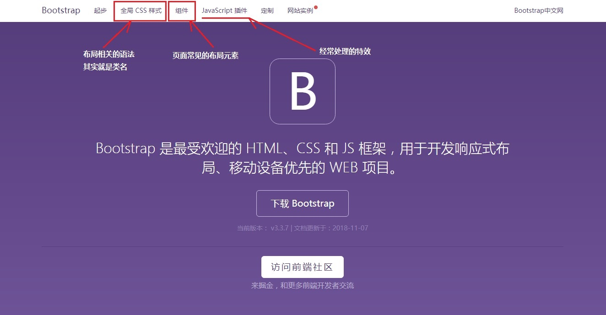
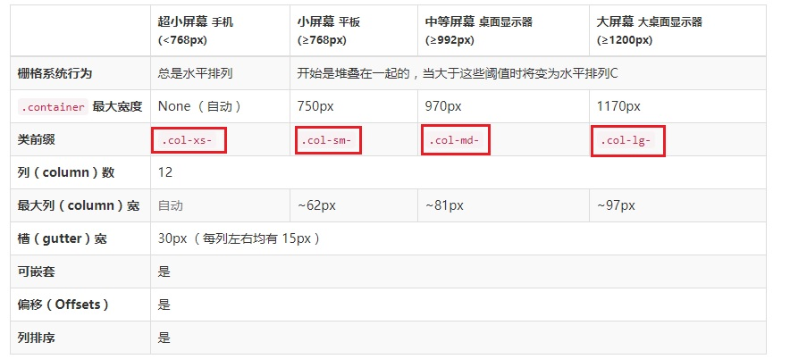

# 移动web开发

---

​	了解插件的使用，能解决什么问题

​	了解响应式开发

## 1.0 fastclick.js

​	使用fastclick.js能解决两个问题

​		移动端点击延迟的问题

​		移动端点透的问题

​			注意：点透不是冒泡，是两个不相关的元素上下覆盖，点击上面的会小时，会触发下面元素的事件


> PC也会响应点击事件


###文档说明


### 代码演示

```javascript
// 1.0 要使用功能，先引入文件

// 1.1 如果是原生代码，就声明以下内容
if ('addEventListener' in document) {
	document.addEventListener('DOMContentLoaded', function() {
		FastClick.attach(document.body);
	}, false);
}

/*
	1.2 使用jQuery的话，声明如下代码
    $(function() {
        FastClick.attach(document.body);
    });
*/

// 1.3 自此，所有的问题就可以当做没有发生了
tap.addEventListener("click",function(){
	tap.style.visibility="hidden";
})
click.addEventListener("click",function(){
	console.log(123);
})
```


---


## 2.0 iscroll.js

​	可以设置某个元素内部区域滚动的功能


### 文档说明

​	在github上面的英文文档如下


### 代码演示

```html
<!DOCTYPE html>
<html lang="en">
<head>
    <meta charset="UTF-8">
    <meta name="viewport"
          content="width=device-width, user-scalable=no, initial-scale=1.0, maximum-scale=1.0, minimum-scale=1.0">
    <title>Title</title>
    <style>
    	* {
    		margin: 0;
    		padding: 0;
    	}
        .wrapper{
            width: 400px;
            height: 400px;
            border: 1px solid #ccc;
            overflow: hidden;
            position: relative;
        }
    </style>
</head>
<body>
<div class="wrapper" id="wrapper">
    <div>
        <p>它只是需要这样的结构，而不是需要这样的标签</p>
        <p>它只是需要这样的结构，而不是需要这样的标签</p>
        <p>它只是需要这样的结构，而不是需要这样的标签</p>
        <p>它只是需要这样的结构，而不是需要这样的标签</p>
        <p>它只是需要这样的结构，而不是需要这样的标签</p>
        <p>它只是需要这样的结构，而不是需要这样的标签</p>
        <p>它只是需要这样的结构，而不是需要这样的标签</p>
        <p>它只是需要这样的结构，而不是需要这样的标签</p>
        <p>它只是需要这样的结构，而不是需要这样的标签</p>
        <p>它只是需要这样的结构，而不是需要这样的标签</p>
        <p>它只是需要这样的结构，而不是需要这样的标签</p>
        <p>它只是需要这样的结构，而不是需要这样的标签</p>
        <p>它只是需要这样的结构，而不是需要这样的标签</p>
        <p>它只是需要这样的结构，而不是需要这样的标签</p>
        <p>它只是需要这样的结构，而不是需要这样的标签</p>
        <p>它只是需要这样的结构，而不是需要这样的标签</p>
        <p>它只是需要这样的结构，而不是需要这样的标签</p>
        <p>它只是需要这样的结构，而不是需要这样的标签</p>
    </div>
</div>
<script src="./js/iscroll.js"></script>
<script type="text/javascript">
    var myScroll = new IScroll('#wrapper',{
        mouseWheel: true,
        scrollbars: true
    });
</script>
</body>
</html>
```


---


## 3.0 swiper.js

​	


> 官网地址    https://www.swiper.com.cn/

课程演示的版本为第3个版本


### 文档说明

​	以下是使用的比较全面的结构


​	详细步骤参考 https://3.swiper.com.cn/usage/index.html


### api详情


###代码演示

​	以下为最基本的使用

```html
<!DOCTYPE html>
<html lang="en">
<head>
	<meta charset="UTF-8">
	<meta name="viewport" content="width=device-width, user-scalable=no, initial-scale=1.0, maximum-scale=1.0, minimum-scale=1.0">
	<title>Document</title>
    <!-- swiper 提供的css处理样式 -->
	<link rel="stylesheet" href="css/swiper.min.css">
    <!-- swiper 提供的主要的js文件 -->
	<script src="js/swiper.min.js"></script>
	<style>
		* {
			padding: 0;
			margin: 0;
		}
		ul {
			list-style: none;
		}
		ul li img {
			display: block;
			width: 100%;
		}
		.swiper-container {
			max-width: 680px;
		}
	</style>
</head>
<body>
	<div class="swiper-container">
		<ul class="swiper-wrapper">
			<li class="swiper-slide">
				<a href="#">
					
				</a>
			</li>
			<li class="swiper-slide">
				<a href="#">
					
				</a>
			</li>
			<li class="swiper-slide">
				<a href="#">
					
				</a>
			</li>
			<li class="swiper-slide">
				<a href="#">
					
				</a>
			</li>
			<li class="swiper-slide">
				<a href="#">
					
				</a>
			</li>
			<li class="swiper-slide">
				<a href="#">
					
				</a>
			</li>
		</ul>
		<div class="swiper-pagination"></div>
	</div>

	<script>
		var mySwiper = new Swiper('.swiper-container', {
            // 自动轮播
			autoplay: 1000,
            // 前后循环
			loop: true,
            // 设置手动滑动后，能恢复自动轮播
			autoplayDisableOnInteraction: false,
            // 显示数量的小点
			pagination : '.swiper-pagination'
		})
	</script>
</body>
</html>
```


---


## 4.0 响应式的介绍


> 什么情况下需要使用响应式

​	电商，旅游，门户...等等网站，由于PC端的页面内容量太大，所以对于移动端，需要重新设计一版较为简洁的专门的移动端项目，这就是前几天练习的项目

​	而一般的企业网站，产品较为单一，内容量比较少，或者宣传页，个人网站等等，没有必须要写PC端之后还写一个移动端，而只是使用响应式做一套项目即可


> 怎么使用响应式布局

​	在传统的响应式布局中，针对于相同的元素，在不同的客户端浏览器，展示不同的摆放位置和大小，而避免重复的计算，一般通过把屏幕分成几个档次

​	根据需要，一般分为3种或者4种档次，在不同的档次，设计师给出不同的设计稿，然后开发人员使用不同的方式进行css布局，并且使用媒体查询在不同的情况引入不同的css文件


### 4.1 媒体查询的使用

​	传统的响应式布局，分为两种情况：

​	

#### 4.1.1 内嵌的CSS样式

```css
/* 1.0 当判断最小的值，并且从小到大进行判断(当满足条件的时候)：
	1.1 向上兼容：如果设置了宽度更小时的样式，默认这些样式也会传递到宽度更大的条件范围内
    1.2 向下覆盖：宽度更大的样式会将前面宽度更小的样式覆盖
*/

/* 2.0 书写建议：
	2.1 如果是判断最小值 (min-width)，那么就应该从小到大写--bootstrap就是判断最小值，从小到大写
    2.2 如果是判断最大值 (max-width)，那么就应该从大到小写
*/

/* 3.0 推荐按照以下方式书写 */
@media screen and (min-width: 768px){
	body {
    	background-color: green;
	}
}
@media screen and (min-width: 992px){
	body {
    	background-color: blue;
    }
}
@media screen and (min-width: 1200px){
	body{
    	background-color: pink;
    }
}
```


#### 4.1.2 使用CSS外联的样式

```html
<!-- 不同的屏幕下，去引入不同的css文件 -->
<link rel="stylesheet" media="screen and(min-width: 1200px)" href="mystylesheet.css">
```


向上兼容：

​	从小到大的声明符合正常的逻辑方式，类似于：三十而立，四十不惑，五十知天命，六十而耳顺，七十而从心所欲...

> 设置 => 50分以上给1颗糖，70分以上给2颗糖，100分以上给一袋糖，如果考了60分呢？


---


## 5.0 Bootstrap的使用

 	在做响应式开发中，或者制作响应式页面的时候，会尽可能去使用UI框架

​	使用UI框架会帮助开发者快速的搭建基本的页面结构，甚至小图标，小组件，还有轮播图等等特效功能都能快速的实现，从而节省时间去做更多的事情，所以不再以传统写页面的方式去做开发

​	UI框架的逻辑基本都是差不多的，所以学习一两种，即使以后使用其他的，上手也会很快


### 5.1 Bootstrap的使用





#### 5.2.1 文件模板

​	关于bootstrap里面的css样式、组件和插件都是直接复制在body之内就完成了

```html
<!DOCTYPE html>
<html lang="zh-CN">
  <head>
    <meta charset="utf-8">
    <meta http-equiv="X-UA-Compatible" content="IE=edge">
    <meta name="viewport" content="width=device-width, initial-scale=1">
    <!-- 上述3个meta标签*必须*放在最前面，任何其他内容都*必须*跟随其后！ -->
    <title>标准页面</title>
    <!-- Bootstrap -->
    <link href="lib/bootstrap/css/bootstrap.min.css" rel="stylesheet">
    <!-- HTML5 shim 和 Respond.js 是为了让 IE8 支持 HTML5 元素和媒体查询（media queries）功能 -->
    <!-- 警告：通过 file:// 协议（就是直接将 html 页面拖拽到浏览器中）访问页面时 Respond.js 不起作用 -->
    <!--[if lt IE 9]>
      <script src="lib/html5shiv/html5shiv.min.js"></script>
      <script src="lib/respond/respond.js"></script>
    <![endif]-->
  </head>
  <body>
    

    <!-- jQuery (Bootstrap 的所有 JavaScript 插件都依赖 jQuery，所以必须放在前边) -->
    <script src="lib/jquery/jquery.min.js"></script>
    <!-- 加载 Bootstrap 的所有 JavaScript 插件。你也可以根据需要只加载单个插件。 -->
    <script src="lib/bootstrap/js/bootstrap.min.js"></script>
  </body>
</html>
```


#### 5.2.2 布局容器

​	只有在做最外层的盒子才需要根据需求设置是版心还是通栏，但是不允许在盒子内嵌套反复使用

​	注意：通栏里面可以嵌套版心

```html
<body>
    <div class="container">这是版心盒子，在手机端的时候是通栏</div>
    <div class="container-fluid">这是通栏的盒子，在什么时候都是通栏</div>
</body>
```


####5.2.3 栅格布局

​	

​	


​	关于屏幕，主要以四种状态为主




​	栅格布局完全可以理解为表格布局，借助传统的表格布局理解

```html
<table>
    <tr>
    	<td>这是第1列</td>
        <td>这是第2列</td>
        <td>这是第3列</td>
    </tr>
    <tr>
    	<td>这是第1列</td>
        <td>这是第2列</td>
        <td>这是第3列</td>
    </tr>
</table>
```

​	

​	使用栅格统的布局

```html
<!-- 设置版心盒子 -->
<div class="container">
    <!-- 设置行 -->
    <div class="row">
        <!-- 设置列 -->
        <div class="col-xs-12 col-sm-6 col-md-4 col-lg-3"></div>
        <div class="col-xs-12 col-sm-6 col-md-4 col-lg-3"></div>
        <div class="col-xs-12 col-sm-6 col-md-4 col-lg-3"></div>
        <div class="col-xs-12 col-sm-6 col-md-4 col-lg-3"></div>
    </div>
  	<div class="row">
        <!-- 设置列 -->
        <div class="col-xs-12 col-sm-6 col-md-4 col-lg-3"></div>
        <div class="col-xs-12 col-sm-6 col-md-4 col-lg-3"></div>
        <div class="col-xs-12 col-sm-6 col-md-4 col-lg-3"></div>
        <div class="col-xs-12 col-sm-6 col-md-4 col-lg-3"></div>
    </div>
</div>
```


- 在xs里面，一列占据一整行

- 在sm里面，一列占据一半

- 在md里面，一列占据3分之一

- 在lg里面，一列占据4分之一


> ##小故事理解向上兼容


有四个小朋友，年龄分别为3岁，5岁，7岁，10岁

​	如果只给3岁的小朋友3颗糖，不加任何其他条件的话，后面3个小朋友也都是3颗糖

​	如果给3岁的小朋友3颗糖，给5岁的小朋友5颗糖，那么后面两个小朋友就都是5颗糖

​	如果给3岁的小朋友3颗糖，给5岁的小朋友5颗糖，给7岁的小朋友7颗糖，最后一个小朋友也是7颗糖

​	

​	使用 hidden-xs 设置在某个屏幕里面隐藏，这个不会存在向上兼容

```html
<div class="container">
	<div class="row">
		<div class="col-xs-1"></div>
        <div class="col-xs-1"></div>
		<div class="col-xs-1"></div>
		<div class="col-xs-1"></div>
		<div class="col-xs-1"></div>
		<div class="col-xs-1"></div>
		<div class="col-xs-1"></div>
		<div class="col-xs-1"></div>
		<div class="col-xs-1"></div>
		<div class="col-xs-1 hidden-md"></div>
		<div class="col-xs-1"></div>
		<div class="col-xs-1"></div>
	</div>
</div>
```


