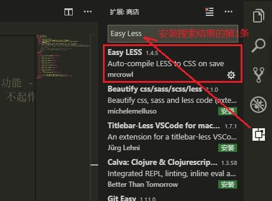
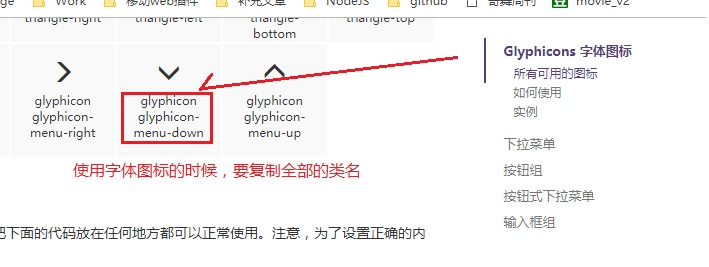
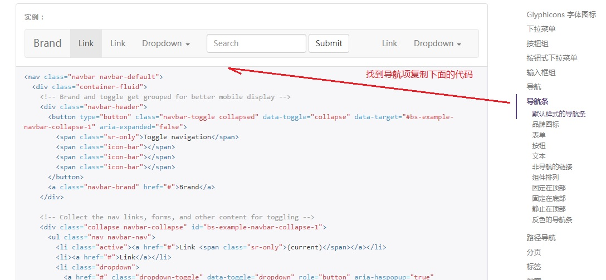
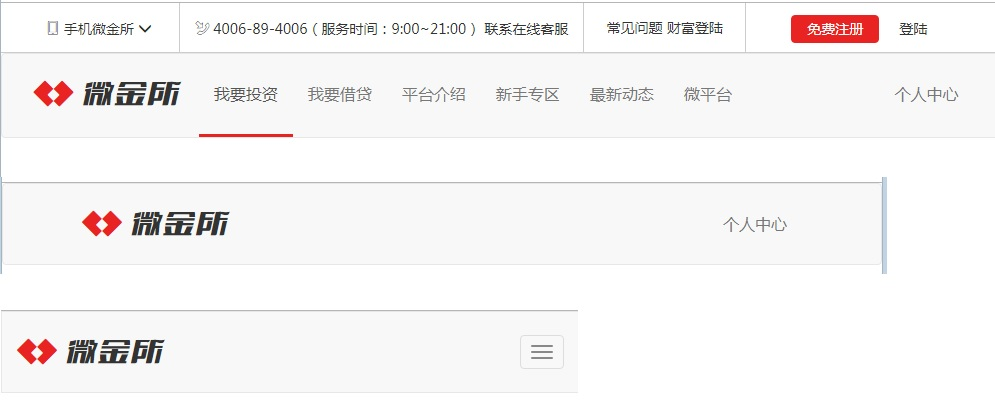

# 移动web开发

---

​	了解less语法，使用bootstrap工具完成微金所

## 1.0 Less的使用

​	使用less语法，能够较快，较清晰的编辑css语句，特别在处理兼容和大量重复代码的时候

###1.1  Less安装





###1.2 Less的语法

​	Less的注释可以是 /**/  也可以是 // ，但是为了避免记混，统一使用前者

#### 变量

```less
/*变量  @变量名:值; */
@baseColor: #e92322;

a{
  color: @baseColor;
}
```


#### 混入

```less
/*相当于定义一个函数的参数*/
.addRadius(@r:10px) {
  border-radius: @r;
  -webkit-border-radius: @r;
  -moz-border-radius: @r;
}

div{
  width: 200px;
  height: 200px;
  /*引入已经写好的圆角样式*/
  /*传入参数*/
  .addRadius(5px);
}
```


#### 嵌套

```less
/*嵌套:实现选择器的继承，可以减少代码量，同时使用代码结构更加清晰*/
.jd_header{
  width: 100%;
  height: 200px;
  .addRadius();
  > div{
    &::before{
      content: "";
    }
    width: 100%;
    >a{
      text-decoration: underline;
      &:hover{
        text-decoration: none;
      }
    }
    > h3{
      height: 20px;
    }
    ul{
      list-style: none;
    }
  }
}
```


---


## 2.0 微金所页面搭建

​	按步骤完成页面

### 准备 base.css

```css
/*公共css样式*/
body{
    font-family: "Microsoft YaHei",sans-serif;
    font-size: 14px;
    color: #333;
}
a{
    text-decoration: none;
    color: #333;
}
a:hover{
    text-decoration: none;
    color: #333;
}
/*左边距*/
.m_l10{
    margin-left: 10px;
}
/*右边距*/
.m_r10{
    margin-right: 10px;
}
/*自定义字体*/
@font-face {
    font-family: 'wjs';
    src: url('../fonts/MiFie-Web-Font.eot'); /* IE9*/
    src: url('../fonts/MiFie-Web-Font.eot') format('embedded-opentype'), /* IE6-IE8 */
    url('../fonts/MiFie-Web-Font.woff') format('woff'), /* chrome、firefox */
    url('../fonts/MiFie-Web-Font.ttf') format('truetype'), /* chrome、firefox、opera、Safari, Android, iOS 4.2+*/
    url('../fonts/MiFie-Web-Font.svg') format('svg'); /* iOS 4.1- */
}
/*自定义字体使用样式*/
.wjs_icon{
    font-family: wjs;
}

/*手机图标对应的编码*/
.wjs_icon_phone::before{
    content: "\e908";
}
/*电话图标对应的编码*/
.wjs_icon_tel::before{
    content: "\e909";
}
/*wjs logo*/
.wjs_icon_logo::before{
    content: "\e920";
}
/*wjs 文本*/
.wjs_icon_text::before{
    content: "\e93e";
}
.wjs_icon_new01::before{
    content: "\e90e";
}
.wjs_icon_new02::before{
    content: "\e90f";
}
.wjs_icon_new03::before{
    content: "\e910";
}
.wjs_icon_new04::before{
    content: "\e911";
}
.wjs_icon_partner01::before{
    content:"\e946";
}
.wjs_icon_partner02::before{
    content: "\e92f";
}
.wjs_icon_partner03::before{
    content: "\e92e";
}
.wjs_icon_partner04::before{
    content: "\e92a";
}
.wjs_icon_partner05::before{
    content: "\e929";
}
.wjs_icon_partner06::before{
    content: "\e931";
}
.wjs_icon_partner07::before{
    content: "\e92c";
}
.wjs_icon_partner08::before{
    content: "\e92b";
}
.wjs_icon_partner09::before{
    content: "\e92d";
}
.wjs_iconn_E903::before{
    content: "\e903";
}
.wjs_icon_E906::before{
    content: "\e906";
}
.wjs_icon_E905::before{
    content: "\e905";
}
.wjs_icon_E907::before{
    content: "\e907";
}
.wjs_icon_E901::before{
    content: "\e901";
}
.wjs_icon_E900::before{
    content: "\e900";
}
.wjs_icon_E904::before{
    content: "\e904";
}
.wjs_icon_E902::before{
    content: "\e902";
}
.wjs_icon_E906::before{
    content: "\e906";
}

```


​	主体骨架

```html
<!DOCTYPE html>
<html lang="zh-CN">
  <head>
    <meta charset="utf-8">
    <meta http-equiv="X-UA-Compatible" content="IE=edge">
    <meta name="viewport" content="width=device-width, initial-scale=1">
    <title>微金所</title>
    <link href="lib/bootstrap/css/bootstrap.min.css" rel="stylesheet">
    <!--[if lt IE 9]>
      <script src="lib/html5shiv/html5shiv.min.js"></script>
      <script src="lib/respond/respond.js"></script>
    <![endif]-->
  </head>
  <body>
    <!-- 头部 -->
    <header class="wjs_header"></header>
    <!-- 导航 -->
    <nav class="wjs_nav"></nav>
    <!-- 轮播图 -->
    <div class="wjs_banner"></div>
    <!-- 信息块 -->
    <div class="wjs_info"></div>
    <!-- 预约块 -->
    <div class="wjs_reverse"></div>
    <!-- 产品块 -->
    <div class="wjs product"></div>
    <!-- 新闻块 -->
    <div class="wjs_news"></div>
    <!-- 合作伙伴 -->
    <footer class="wjs_partner"></footer>

    <script src="lib/jquery/jquery.min.js"></script>
    <script src="lib/bootstrap/js/bootstrap.min.js"></script>
  </body>
</html>
```


### 2.1 头部导航

​	根据标准的栅格系统方式排版

```html
    <!-- 头部 -->
    <header class="wjs_header hidden-xs hidden-sm">
        <div class="container">
            <div class="row">
                <div class="col-md-2">
                    <a href="#" class="wjs_code">
                        <span></span>
                        <span>手机微金所</span>
                        <span></span>
                        
                    </a>
                </div>
                <div class="col-md-5">
                    <span></span>
                    <a href="#">4006-89-4006（服务时间：9:00~21:00） 联系在线客服</a>
                </div>
                <div class="col-md-2">
                    <a href="#">常见问题</a>
                    <a href="#">财富登陆</a>
                </div>
                <div class="col-md-3">
                    <button class="btn btn-danger">免费注册</button>
                    <button class="btn btn-link">登陆</button>
                </div>
            </div>
        </div>
    </header>
```


###2.2  完成头部css样式

```less
/*定义变量*/
@baseColor:#e92322;
/*头部块样式*/
.wjs_header{
  height: 50px;
  line-height: 50px;
  border-bottom: 1px solid #ccc;
  .row{
    height: 100%;
    text-align: center;
    > div:nth-of-type(-n+3){
      border-right: 1px solid #ccc;
      > .wjs_code{
        position: relative;
        display: block;
        > img{
          display: none;
          position: absolute;
          top: 49px;
          left: 50%;
          transform: translateX(-50%);
          border: 1px solid #ccc;
          border-top:none;
          z-index: 999;
        }
        &:hover{
          > img{
            display: block;
          }
        }
      }
    }
    >div:nth-last-of-type(1){
      > .btn-danger{
        background-color: @baseColor;
        border-color: @baseColor;
      }
      > .btn{
        padding:3px 15px;
      }
      > .btn-link{
        color: #333;
        &:hover{
          text-decoration: none;
        }
      }
    }
  }
}
```





### 2.3 使用导航条组件




​	内容骨架

```html
    <!-- 导航 -->
    <nav class="navbar navbar-default wjs_nav">
        <div class="container">
                <div class="navbar-header">
                    <button type="button" class="navbar-toggle collapsed" data-toggle="collapse" data-target="#bs-example-navbar-collapse-1" aria-expanded="false">
                        <span class="icon-bar"></span>
                        <span class="icon-bar"></span>
                        <span class="icon-bar"></span>
                    </button>
                    <a class="navbar-brand" href="#">
                        <span class="wjs_icon wjs_icon_logo"></span>
                        <span class="wjs_icon wjs_icon_text"></span>
                    </a>
                </div>
                <div class="collapse navbar-collapse" id="bs-example-navbar-collapse-1">
                    <ul class="nav navbar-nav hidden-sm">
                        <li class="active"><a href="#">我要投资</a></li>
                        <li><a href="#">我要借贷</a></li>
                        <li><a href="#">平台介绍</a></li>
                        <li><a href="#">新手专区</a></li>
                        <li><a href="#">最新动态</a></li>
                        <li><a href="#">微平台</a></li>
                    </ul>
                    <ul class="nav navbar-nav navbar-right">
                        <li><a href="#">个人中心</a></li>
                    </ul>
                </div>
        </div>
    </nav>
```


#### 样式修改

```less
/*导航样式*/
.wjs_nav{
  &.navbar{
    margin-bottom: 0;
  }
  .navbar-brand{
    height: 80px;
    line-height:50px;
    > .wjs_icon{
      font-size: 40px;
    }
    > span:first-of-type{
      color: @baseColor;
    }
    > span:last-of-type{
      color: #333;
    }
  }
  /*修改导航项的样式*/
  .navbar-nav{
    > li{
      > a{
        line-height: 50px;
        font-size: 16px;
      }
      > a:hover,a:focus{
        color: #777;
        border-bottom: 3px solid @baseColor;
      }
    }
    .active{
      > a,a:hover,a:focus{
        background-color:transparent;
        border-bottom: 3px solid @baseColor;
      }
    }
  }
  .navbar-toggle{
    margin-top:23px;
  }
}
```





### 总结


> ### ！！！使用组件可以自己修改标签名或者删减结构
>
> ### ！！！修改样式有一定的规则


- 不允许修改源代码

- 复制粘贴的代码片段也不要修改，会影响后期其他的组件

- 给父盒子设置新的类名，而不用给每一个子盒子也设置

  ​

---


## 3.0  响应式轮播图


### 3.1 完成移动端轮播图

```html
<style>
    .mobileImg{
        width: 100%;
        display: block;
    }
    .mobileImg > img{
        width: 100%;
        display: block;
    }
</style>
<div id="carousel-example-generic" class="carousel slide" data-ride="carousel">
    <ol class="carousel-indicators">
        <li data-target="#carousel-example-generic" data-slide-to="0" class="active"></li>
        <li data-target="#carousel-example-generic" data-slide-to="1"></li>
        <li data-target="#carousel-example-generic" data-slide-to="2"></li>
        <li data-target="#carousel-example-generic" data-slide-to="3"></li>
    </ol>

    <div class="carousel-inner" role="listbox">
        <div class="item active">
            <a href="javascript:;" class="mobileImg">
                
            </a>
        </div>
        <div class="item">
            <a href="javascript:;" class="mobileImg">
                
            </a>
        </div>
        <div class="item">
            <a href="javascript:;" class="mobileImg">
                
            </a>
        </div>
        <div class="item">
            <a href="javascript:;" class="mobileImg">
                
            </a>
        </div>
    </div>

    <a class="left carousel-control" href="#carousel-example-generic" role="button" data-slide="prev">
        <span class="glyphicon glyphicon-chevron-left" aria-hidden="true"></span>
        <span class="sr-only">Previous</span>
    </a>
    <a class="right carousel-control" href="#carousel-example-generic" role="button" data-slide="next">
        <span class="glyphicon glyphicon-chevron-right" aria-hidden="true"></span>
        <span class="sr-only">Next</span>
    </a>
</div>
```


### 3.2 完成PC端轮播图

```html
<style>
    .pcImg{
        width: 100%;
        height: 410px;
        display: block;
        /*设置背景图片了*/

        /*设置图片居中显示*/
        background-position: center center;
        /*设置背景图片的大小*/
        background-size: cover;
    }
</style>
<div id="carousel-example-generic" class="carousel slide" data-ride="carousel">
    <!-- Indicators -->
    <ol class="carousel-indicators">
        <li data-target="#carousel-example-generic" data-slide-to="0" class="active"></li>
        <li data-target="#carousel-example-generic" data-slide-to="1"></li>
        <li data-target="#carousel-example-generic" data-slide-to="2"></li>
        <li data-target="#carousel-example-generic" data-slide-to="3"></li>
    </ol>

    <!-- Wrapper for slides -->
    <div class="carousel-inner" role="listbox">
        <div class="item active">
            <a href="javascript:;" class="pcImg" 
               style="background-image: url('./images/slide_01_2000x410.jpg');"></a>
        </div>
        <div class="item">
            <a href="javascript:;" class="pcImg" 
               style="background-image: url('./images/slide_02_2000x410.jpg');"></a>
        </div>
        <div class="item">
            <a href="javascript:;" class="pcImg" 
               style="background-image: url('./images/slide_03_2000x410.jpg');"></a>
        </div>
        <div class="item">
            <a href="javascript:;" class="pcImg" 
               style="background-image: url('./images/slide_04_2000x410.jpg');"></a>
        </div>
    </div>
    <a class="left carousel-control" href="#carousel-example-generic" role="button" data-slide="prev">
        <span class="glyphicon glyphicon-chevron-left" aria-hidden="true"></span>
        <span class="sr-only">Previous</span>
    </a>
    <a class="right carousel-control" href="#carousel-example-generic" role="button" data-slide="next">
        <span class="glyphicon glyphicon-chevron-right" aria-hidden="true"></span>
        <span class="sr-only">Next</span>
    </a>
</div>
```


### 3.3   按照需求加载图片


#### 改造后的结构

```html
<div class="wjs_banner">
    <div id="carousel-example-generic" class="carousel slide" data-ride="carousel">
        <!-- 设置小点的列表 -->
        <ol class="carousel-indicators">
            <li data-target="#carousel-example-generic" data-slide-to="0" class="active"></li>
            <li data-target="#carousel-example-generic" data-slide-to="1"></li>
            <li data-target="#carousel-example-generic" data-slide-to="2"></li>
            <li data-target="#carousel-example-generic" data-slide-to="3"></li>
        </ol>
        <!-- 主要轮播的图片列表 -->
        <div class="carousel-inner" role="listbox">
            <div class="item active" 
                 data-large-image="./images/slide_01_2000x410.jpg" 
                 data-small-image="./images/slide_01_640x340.jpg"></div>
            <div class="item" 
                 data-large-image="./images/slide_02_2000x410.jpg" 
                 data-small-image="./images/slide_02_640x340.jpg"></div>
            <div class="item" 
                 data-large-image="./images/slide_03_2000x410.jpg" 
                 data-small-image="./images/slide_03_640x340.jpg"></div>
            <div class="item" 
                 data-large-image="./images/slide_04_2000x410.jpg" 
                 data-small-image="./images/slide_04_640x340.jpg"></div>
        </div>
      	<!-- 设置左右点击的按钮 -->
        <a class="left carousel-control" href="#carousel-example-generic" role="button" data-slide="prev">
            <span class="glyphicon glyphicon-chevron-left" aria-hidden="true"></span>
            <span class="sr-only">Previous</span>
        </a>
        <a class="right carousel-control" href="#carousel-example-generic" role="button" data-slide="next">
            <span class="glyphicon glyphicon-chevron-right" aria-hidden="true"></span>
            <span class="sr-only">Next</span>
        </a>
    </div>
</div>
```


#### 修改的样式

```less
/*轮播图样式*/
.wjs_banner{
  .mobileImg{
    width: 100%;
    display: block;
  }
  .mobileImg > img{
    width: 100%;
    display: block;
  }
  .pcImg{
    width: 100%;
    height: 410px;
    display: block;
    /*设置图片居中显示*/
    background-position: center center;
    /*设置背景图片的大小*/
    background-size: cover;
  }
}
```


#### 加入的JS功能

```javascript
    /*获取当前所有item*/
    var items = $(".carousel-inner .item");
    /*监听屏幕的大小改变*/
    $(window).on("resize", function() {
        /*1.获取当前屏幕的宽度*/
        var width = $(window).width();
        /*2.判断屏幕的宽度*/
        if(width >= 768) {/*说明非移动端*/
            /*为每一个item添加子元素--遍历*/
            $(items).each(function(index, value){
                var item = $(this);
                /*当前自定义属性中 存储的图片路径*/
                var imgSrc = item.data("largeImage");
                /*添加非移动端的子元素*/
                item.html($('<a href="javascript:;" class="pcImg"></a>').css("backgroundImage","url('"+imgSrc+"')"));
            });
        } else {
            $(items).each(function(index, value){
                var item = $(this);
                var imgSrc = item.data("smallImage");
                item.html('<a href="javascript:;" class="mobileImg"></a>');
            });
        }
    }).trigger("resize");
```


### 3.4 滑动轮播图

```javascript
    /*添加移动端的滑动操作*/
    var startX, endX;
    var carousel_inner = $(".carousel-inner")[0];
    carousel_inner.addEventListener("touchstart",function(e){
        startX = e.targetTouches[0].clientX;
    });
    carousel_inner.addEventListener("touchend",function(e){
        endX = e.changedTouches[0].clientX;
        if(endX - startX > 0){
            /*上一张*/
            $(".carousel").carousel('prev');
        } else if(endX - startX < 0){
            /*下一张*/
            $(".carousel").carousel('next');
        }
    });
```


### 3.5 总结


> ### 响应式轮播图的技术点


1， 无非是 768 以下的屏幕  xs    和     768以上    sm、md、lg   的区别

2，在移动端使用插入图，为了使图片能够自动响应宽高比例

3，在非移动端使用背景图，因为一般pc端的图都很大，仅仅显示局部即可

4，在查看移动端的时候，不需要加载PC端的资源和结构

5，在查看非移动端的时候，不需要加载移动端的资源和结构


